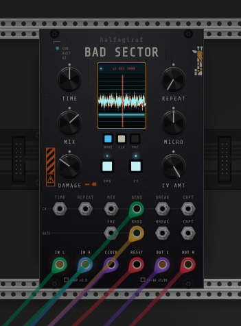
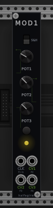
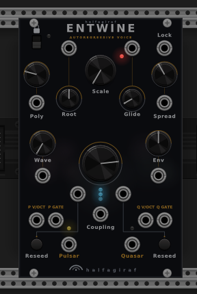
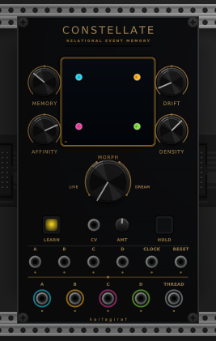

# halfagiraf Modules

VCV Rack 2 modules by halfagiraf.

## Modules

### [Bad Sector](docs/BadSector.md)

<p align="center"></p>

A stereo buffer-corruption effect for broken, repeating and degraded playback. Bend, Break and Corrupt can be clocked to the same timing grid.

[](https://www.youtube.com/watch?v=EV3uuw9fdKU)

### [MOD1](docs/MOD1.md)

<p align="center"></p>

Three bipolar random-voltage outputs with smooth and sample-and-hold modes. It runs from its own clock or an external one.

### [Entwine](docs/Entwine.md)

<p align="center"></p>

A 16-voice autoregressive synthesizer built around two interlaced streams, Pulsar and Quasar. It can free-run, follow a clock, or send V/Oct and gates to other voices.

### [Constellate](docs/Constellate.md)

<p align="center"></p>

Learns the relationships between four trigger streams, then uses that memory to produce related variations. THREAD outputs the confidence of each generated choice as CV.

[Watch the 15-second Constellate demo](docs/Constellate-demo.mp4)

## Install

The plugin is being reviewed for the VCV Library. In the meantime, platform builds are available from [GitHub Releases](https://github.com/stevenmcsorley/halfagiraf-modules/releases/latest).

## Build

With the VCV Rack SDK in the adjacent `Rack-SDK` directory:

```sh
make test
make -j4
make dist
```

## License

GPL-3.0-or-later. Panel artwork © halfagiraf. Attribution notes are included in the module manuals.
