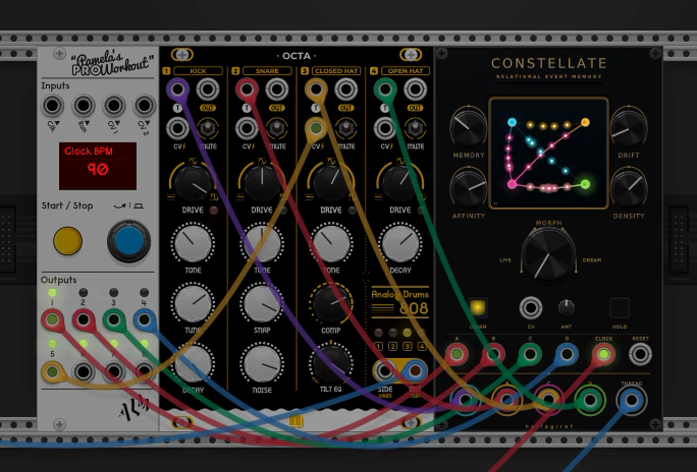

# Constellate


Constellate is a 15 HP, four-channel relational event memory for VCV Rack 2. It listens to trigger streams A-D, learns which events tend to follow one another and at what pace, and produces coherent variations from that learned behavior.

It is not a fixed step sequencer. The module builds a variable-order transition model from the patch itself, so its output can retain recurring phrases and relationships without simply looping a recording.

## Demo

[](Constellate-demo.mp4)

[Watch or download the 15-second MP4](Constellate-demo.mp4)

## Quick start

1. Patch related triggers or gates into **A-D**. **LEARN** is enabled by default.
2. Leave **MORPH** at **LIVE** to hear the four inputs pass through unchanged while the constellation forms on the display.
3. Turn **MORPH** toward **DREAM**. Incoming events are increasingly replaced by choices learned from the combined event history.
4. Patch a trigger to **CLOCK** to request generated events rhythmically. With all event inputs and CLOCK unplugged, a learned constellation free-runs using its recorded timing.
5. Use **HOLD** to freeze the learned model while continuing to perform with it.

## Controls

| Control | Function |
| --- | --- |
| **MEMORY** | Chooses one to four previous events as the context for the next decision. Longer memory preserves phrases; shorter memory is more fluid. |
| **AFFINITY** | Sharpens learned preferences. Low settings flatten the choices; high settings strongly favor established paths. |
| **DRIFT** | Blends the learned distribution toward unexplored A-D choices. |
| **DENSITY** | Controls the probability of a generated event on CLOCK and the pace/activity of free-running dreams. |
| **MORPH** | Moves from unaltered live routing to learned generative substitutions. |
| **MORPH CV / AMT** | Adds bipolar, attenuverted CV to MORPH. At +100%, 0-10 V spans the full LIVE-to-DREAM range; negative settings invert the movement. |
| **LEARN** | Enables or disables updates to the relational memory. |
| **HOLD** | Temporarily freezes the current constellation without changing the LEARN preference. |

## Connections

- **A-D inputs:** trigger/gate streams to learn and transform.
- **CLOCK:** requests dream events on incoming clock edges.
- **RESET:** returns the playback context to the most recently learned phrase without deleting memory.
- **MORPH CV:** voltage control of the LIVE/DREAM position through the adjacent bipolar AMT attenuverter.
- **A-D outputs:** 10 V triggers, color-matched to the nodes on the display.
- **THREAD:** 0-10 V confidence for the most recent generated choice. Strong, well-learned transitions produce higher voltage; live or uncertain events produce lower voltage.

The display is driven by the real first-order transition matrix. Its labelled nodes map directly to A-D. A coloured source-to-destination line means that one event has been observed following another; brightness and thickness show probability, fixed route stars show accumulated evidence, and a bright travelling bead marks each transition as it actually fires. The lower amber meter shows THREAD confidence.

## Memory and persistence

The learned constellation, timing estimates, playback context, button states, and random-generator state are saved in the Rack patch. Right-click the module to clear the learned constellation, reseed generation, or change trigger length.

## Build

Set `RACK_DIR` to a VCV Rack 2 SDK and run:

```sh
make -j4 dist
```

Run the standalone deterministic engine tests with:

```sh
make test
```

GitHub Actions builds release packages for Windows x64, Linux x64, macOS Intel, and macOS Apple Silicon.

## Identity and license

- Plugin slug: `halfagiraf`
- Plugin name: `halfagiraf Modules`
- Module slug: `Constellate`
- License: GPL-3.0-or-later
