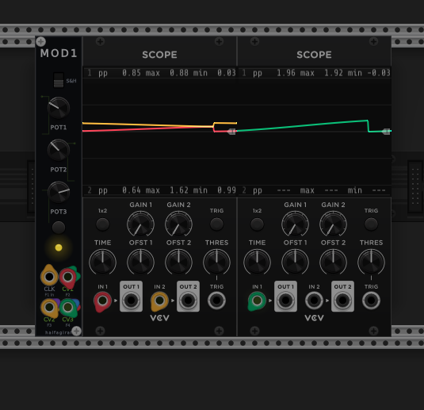

# MOD1

**A three-channel clocked random CV generator for VCV Rack 2**, by halfagiraf.

<p align="center">
  
</p>

MOD1 produces three independent bipolar random voltages. Each output has its own
amount control and configurable voltage offset. The streams can glide continuously
between random targets or change as stepped sample-and-hold voltages.

## Features

- Three independently scaled random CV outputs.
- Smooth interpolation or stepped sample-and-hold motion.
- External clock input with automatic period tracking.
- Adjustable internal clock when no external clock is connected.
- Manual re-randomize button.
- Per-output offsets from -5 V to +5 V in the context menu.
- Output limiting to the standard -10 V to +10 V Rack range.

## In use

The three coloured traces below show MOD1's independently scaled random outputs
in smooth mode, monitored with VCV Scope modules.

<p align="center">
  
</p>

## Installation

Download the `.vcvplugin` file matching your computer from the
[latest GitHub release](https://github.com/stevenmcsorley/halfagiraf-modules/releases/latest),
copy it into Rack's matching `plugins-<OS>-<CPU>` folder, and restart Rack. Rack
will extract and load the package automatically.

## Building

Requires the [VCV Rack SDK](https://vcvrack.com/manual/Building#setting-up-your-development-environment).
With `Rack-SDK` beside this repository:

```sh
make -j4
make dist
```

The editable panel is `res_text_backup/MOD1.svg`. Regenerate the Rack-compatible
text-as-path panel after editing it with:

```sh
python tools/bake_svg_text.py res_text_backup/MOD1.svg res/MOD1.svg
```

## Background

This VCV module is an adaptation of HAGIWO's open-source MOD1 general-purpose
CV/Gate hardware platform. The physical MOD1 design and community firmware
collection are documented by the
[Modulove MOD1 project](https://github.com/modulove/MOD1), which is released
under the [CC0 1.0 Universal public-domain dedication](https://github.com/modulove/MOD1/blob/main/LICENSE),
allowing the design to be reused and adapted for any purpose. This repository is
an independent VCV implementation and is not affiliated with or endorsed by
HAGIWO or Modulove.

## License

GPL-3.0-or-later. See [LICENSE](../LICENSE). Panel artwork © halfagiraf.
