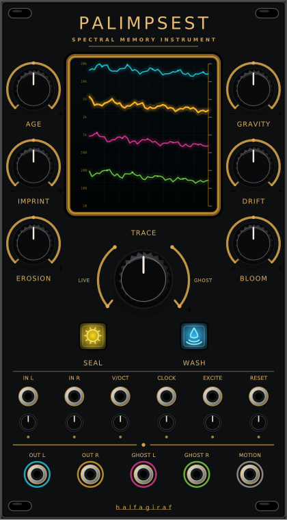

# Palimpsest



Palimpsest is a 14 HP stereo spectral-memory instrument for VCV Rack 2. It continuously analyzes incoming sound, writes that energy into four progressively older spectral layers, and resynthesizes the memory as a phase-continuous ambient voice.

It is not a looper, granular processor, or conventional reverb. Palimpsest stores evolving frequency energy rather than recorded waveform fragments, allowing new material to overwrite, tune, erode, and awaken what came before.

## Quick start

1. Patch a voice, piano, field recording, or full mix into **IN L**. **IN R** is normalled from the left input.
2. Let the module listen for several seconds with **IMPRINT** around noon.
3. Move **TRACE** from **LIVE** toward **GHOST** to hear the reconstructed memory.
4. Increase **AGE** to reach slower, older layers. Use **GRAVITY**, **DRIFT**, and **EROSION** to reshape them.
5. Press **SEAL** to prevent new material from changing the stored spectrum. Press **WASH** to dissolve the memory gradually.

## Controls

| Control | Function |
| --- | --- |
| **AGE** | Selects continuously between the newest and oldest of four cascading memory layers. |
| **IMPRINT** | Controls how quickly current audio overwrites the youngest layer. |
| **EROSION** | Removes weak spectral material at different deterministic rates, opening fragile gaps. |
| **GRAVITY** | Pulls remembered energy toward the spectral center of the live input. |
| **DRIFT** | Applies independent slow pitch movement to remembered frequency bands. |
| **BLOOM** | Extends memory persistence through bounded spectral feedback. |
| **TRACE** | Equal-power morph from latency-aligned live audio to spectral memory. |
| **SEAL** | Freezes spectral writing and erosion while playback continues. |
| **WASH** | Smoothly erases all four memory layers. |

## Connections and trims

- **IN L / IN R:** stereo audio. Their trims provide -12 to +12 dB input gain; IN R normals to IN L.
- **V/OCT:** transposes the memory around its stored spectrum. The trim ranges from zero to two octaves per volt, with one octave per volt at noon.
- **CLOCK:** advances the selected memory age. Its trim sets step depth.
- **EXCITE:** opens the remembered voice with a soft transient envelope. Its trim controls excitation strength.
- **RESET:** resets age traversal and spectral phase. Its trim controls reset depth.
- **OUT L / OUT R:** TRACE-morphed stereo output.
- **GHOST L / GHOST R:** memory-only resynthesis, independent of TRACE.
- **MOTION:** 0-10 V representation of real spectral change in the memory engine.

The display is driven entirely by the active memory. Cyan, amber, magenta, and acid-green traces represent the four age layers; their brightness and movement follow stored energy and spectral flux rather than decorative animation.

## Memory and safety

The spectral memory and SEAL state are stored in the Rack patch. Internal feedback is soft-limited, DC-blocked, and bounded. The audio thread performs no dynamic allocation, file access, locking, or FFT-plan construction.

## Build

Set `RACK_DIR` to a VCV Rack 2 SDK and run:

```sh
make -j4 dist
```

Run the standalone deterministic engine tests with:

```sh
make test
```

GitHub Actions builds Windows x64, Linux x64, macOS Intel, and macOS Apple Silicon packages.

## Identity and license

- Plugin slug: `halfagiraf`
- Plugin name: `halfagiraf Modules`
- Module slug: `Palimpsest`
- License: GPL-3.0-or-later
